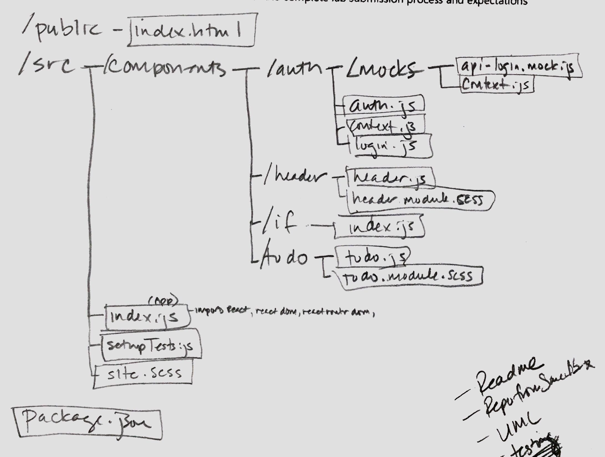

# LAB 31 - Hooks API

### Author: Gina Pultorak

### Links and Resources
* [submission PR](https://github.com/ginapult-401-advanced-javascript/lab-31-hooks-api/pull/1)
* [travis](https://travis-ci.com/ginapult-401-advanced-javascript/lab-31-hooks-api)
* [front-end](https://codesandbox.io/embed/github/ginapult/lab-31-hooks-api/tree/master/) (code sandbox)

#### Documentation
* [na](na)

#### Tests
* Unit Tests: 'npm test'
* Lint Tests: 'npm run lint'

#### UML

